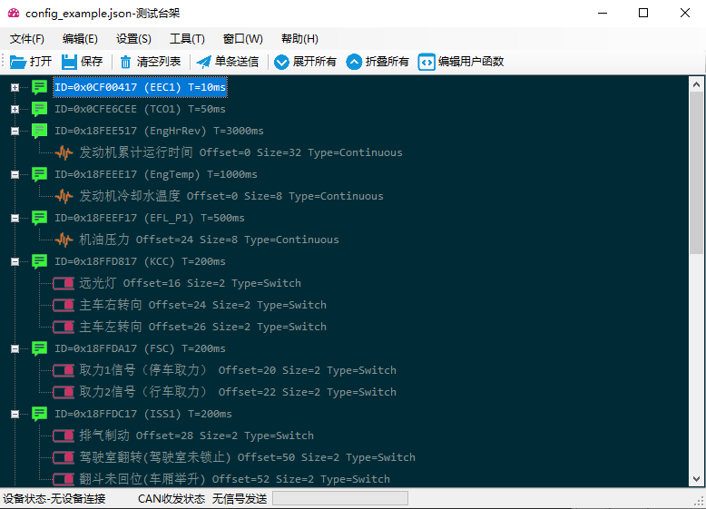

# CAN信号测试台架

## 简介

有很多设备可以读取CAN总线上的数据，或者模拟发生数据，而可编程的平台并不多，一般是借助厂商提供的API调用驱动，达成和设备进行数据交换的目的。

本软件的目的，是构建一个通用的CAN通信规范，可以兼容多种设备，同时有着统一的编程接口，可以对CAN总线进行各种数据操作，完成模拟或者测试的工作。我决定将我这部分工作开源出来，是为了所有饱受手工操作之苦的测试人员做一点事情。

成本起见，请尽可能使用便宜的设备，如果总线负载重，超过500帧每秒，请选择贵一点的设备。

## 使用文档

### 软件概览



### 信号量编辑

一个CAN ID发出的报文（Message）可能承载多个信号（Signal），这个里面，有些是连续量，有些是离散量，还有一些有着特殊的解析（例如DM1故障码）。

同时，开关量也有着和正常逻辑不同的定义，除了开，关以外，还有错误和无效两种状态。

为了方便测试人员进行硬件测试，这里预设了大部分可能用到的类型，你也可以通过JavaScrip函数（点击“编辑用户函数”）来完成一些比较复杂的逻辑（CAN ID上点击右键-增加信号-用户自定义即可）。

### 设备连接

点击设置菜单，即可选择你需要的设备去连接。

### TODO

这个软件本身比较简单，熟悉1939协议的很快应该就能上手，重点介绍可编程部分而不是GUI。


## JS API 使用文档

本节面对的是专业的开发人员，需要**熟练掌握JavaScript的基础语法**和少量C#的知识。
本节的目的是帮助专业的开发人员完成个性化的开发，开发的内容包括但不局限于信号测试，功能测试，UDS和网络管理测试。

请在窗口菜单中打开IDE。

本模块的功能是极其强大的，举个例子，我们如何通过变成完成一个简单的UDS模式跳转测试：

```javascript
/*
	测试用例：
	默认会话模式跳转到扩展会话模式
*/
function str2arr(str){
	var arr = str.split(" ");
	var arr_new = [];
	for (var i = 0; i<arr.length; i++){
		arr_new.push(parseInt(arr[i],16));
	}
	return arr_new;
}
var testCase = "默认会话模式跳转到扩展会话模式";
var HEX = 16;
/*
地址规范
	18DBFFF9 TEL 远程诊断功能寻址诊断请求
	18DAFDF9 TEL 对 TEL 的物理寻址诊断请求
	18DAF9FD TEL 对 TEL 的物理寻址诊断响应
	18DBFFFA 外部测试设备的功能寻址诊断请求
	18DAFDFA 外部测试设备对 TEL 的物理寻址诊断请求
	18DAFAFD TEL 对外部测试设备的物理寻址诊断响应
*/

var IDTx = parseInt("18DBFFFA",HEX);
var IDRx = parseInt("18DAFAFD",HEX);
var IDSpeed = parseInt("CFE6CEE",HEX);
var IDT15 = parseInt("18FFC325",HEX);
//持续发送信号
var TxSpeed = $.newSendThread(
	$.getNewCANData(IDSpeed,[0,0,0,0,0,0,0,0]),50
);
TxSpeed.start();

var TxT15 = $.newSendThread(
	$.getNewCANData(IDT15,str2arr("00 00 10 15 00 00 00 00")),100
);
TxT15.start();
$.print("背景送信已经启动，延迟中...")
$.sleep(100);
try{
	var TxData = $.getNewCANData(IDTx,str2arr("02 10 03 FF FF FF FF FF"));
	$.sendData(TxData);
	$.print("数据已发送:" + TxData)
	var dataSample = $.getNewCANData(IDRx,str2arr("06 50 03 00 32 00 C8 FF"));
	//等待数据的到来，时间5秒
	$.print("数据已发送，等待中...");
	$.print($.waitMessage(dataSample,5000));
	$.print(testCase + "测试结果：本例Passed！");
}catch(err){
	$.print(testCase + "测试Failed！理由：");
	$.print(err);
}

TxSpeed.stop();
TxT15.stop();
```

当然测试之前请先连接好你的设备，再次熟悉你要进行的测试，并且可以用编程语言描述出来。

### 私有API详述
在使用手册中，我们简单的介绍了API的使用方法，并且给出了简单的描述，在这里我们会对系统内置的，且非V8引擎内生支持的API进行详细描述。

#### 命名空间
本程序用`$`符号承载API的命名空间，但是你可以对函数进行封装以适合您的使用习惯。
请不要覆盖这个变量否则就都没了。
例如：
```javascript
$.print("Hello world!")
```

经过封装可以等效：
```javascript
function print(str){
	$.print(str);
}
print("Hello world!")
```

你可以将这些代码写入`UserLib.js`中以便每次加载您的设定，也可以单独写成js文件，然后再`UserLib.js`中使用`$.loadJSFile()`函数加载。
需要说明的是，为了可拓展性，本程序并没有使用V8的Snapshot技术，所以你加载的程序太多的时候，可能会造成界面假死。

#### User I/O Functions
用户输入/输出函数组用来进行和使用程序的用户（当然用户一般是开发者本身）的交互操作。

##### `$.alert()`
**函数原型**
```csharp
public static void alert(string queryInfo, string title);
public static void alert(string queryInfo);
```

**说明**
`$.alert()`是函数，作用是弹出一个消息框，同时阻塞Javascript脚本的运行，本函数没有返回值。
`$.alert(text)`:消息框内容是text，标题是`JavaScript Utility`。
`$.alert(text,title)`:消息框内容是text，标题是title。
 
**练一练**
```javascript
var text = "Hello world";
var title = "Test";
$.alert(text);
$.alert(text,title);
```

##### `$.confirm()`
**函数原型**
```csharp
public static bool confirm(string queryInfo, string title);
public static bool confirm(string queryInfo);
```

**说明**
`$.confirm()`是函数，作用是弹出一个对话框，同时阻塞程序的运行，返回布尔型的数值。
`$.confirm(text)`:消息框内容是text，标题是`JavaScript Utility`。
`$.confirm(text,title)`:消息框内容是text，标题是title。
返回值描述的是用户的点击结果，如果返回值是`True`说明用户点击了“是”，否则点击了“否”或者关闭了对话框（废话）。

**练一练**
```javascript
var userInput = $.confirm("Do you love me?","Query");
if (userInput){
    $.alert("Thank you for your love");
}else{
    $.alert("Damn it");
}
```

##### `$.inputbox()`
**函数原型**
```csharp
public static string inputbox(string title, string initString);
public static string inputbox(string title);
public static string inputbox();
```

**说明**
`$.inputbox()`是函数，作用是弹出一个对话框，同时阻塞程序的运行，获取用户输入的字符串。
`$.confirm(title)`:消息框标题是title。
`$.confirm(title,info)`:消息框提示内容是info，标题是title。
返回值为用用户输入内容

**练一练**
```javascript
var userInput = $.inputbox("Input your name");
$.print("Hello " + userInput);
```

##### `$.log()`
**函数原型**
```csharp
public static void log(string text);
```

**说明**
`$.log()`是函数，作用是向本程序的日志系统写入一条日志（该日志会以文件的形式保存）。
`$.log(text)`:向日志系统注入一条日志。

**练一练**
```javascript
$.log("This is my first log.")
```
##### `$.print()`
**函数原型**
```csharp
public static void print(object obj);
```

**说明**
`$.print()`是函数，作用是向IDE的输出界面输出一个对象。
`$.print(text)`:向IDE的输出界面输出一个对象。

**练一练**
```javascript
$.print("This is my first print.")
```

#### Net I/O Functions
##### `$.get()`
**函数原型**
```csharp
public static string get(string urlget, int timeout);
public static string get(string urlget);
```

**说明**
`$.get()`是函数，作用是模拟浏览器使用HTTP(S)协议获取网页内容。
`$.get(url)`：获取URL指向的地址，如果超过10秒仍然没有获取就默认超时了。
`$.get(url,timeout)`：获取URL指向的地址，如果超过timeout毫秒仍然没有获取就默认超时了。
**练一练**
（注意，联系的时候请连接互联网）
```javascript
$.print($.get("http://www.sqtxj.com:10086/"));//获取2.0网站的页面内容
```


##### `$.getServerTime()`
**函数原型**
```csharp
public static DateTime getServerTime(string urlget, int timeout);
public static DateTime getServerTime(string urlget);
```

**说明**
`$.getServerTime()`是函数，作用是模拟浏览器使用HTTP(S)协议获取Header中的Date属性。
`$.getServerTime(url)`：获取URL的Header中的Date属性，如果超过10秒仍然没有获取就默认超时了。
`$.get(url,timeout)`：获取URL的Header中的Date属性，如果超过timeout毫秒仍然没有获取就默认超时了。
**练一练**
（注意，联系的时候请连接互联网）
```javascript
$.print($.getServerTime("http://www.baidu.com"));
```


#### CAN I/O Functions
本程序用来做CAN设备的收发控制，所有涉及CAN收发的函数都需要正确的配置CAN设备。

##### `$.getNewCANData()`
**函数原型**
```csharp
public static CANData getNewCANData(int ID, int[] Data);
```

**说明**
`$.getNewCANData()`是函数，作用是生成一个CANData类型的数据。
`$.getNewCANData(ID,Data)`：其中ID是CANID，如果你的CANID是十六进制的可以使用这样的方法处理：
```javascript
var CANID = parseInt("12FCEE4",16);
```

Data是数组，长度任意，但是某些设备不支持长度不为8的CAN Data，发送可能出错。

##### `$.transmitData()`

**函数原型**
```csharp
public static void transmitData(CANData cd);
public static void transmitData(int ID, int[] Data);
```

**说明**
`$.transmitData()`是函数，作用是发送一个CANData类型的数据。
`$.transmitData(CANData)`：其中CANData是使用`$.getNewCANData()`生成的数据类型。
`$.getNewCANData(ID,Data)`：ID和Data的意义同`$.getNewCANData()`的定义，相当于函数：
`$.transmitData($.getNewCANData(ID,Data))`
**请确保正确的初始化了设备**，否则送信可能抛出一个错误。

**练一练**
```javascript
var data = $.getNewCANData(123, [1,2,3,4,5,6,7,8]);
$.transmitData(data);
$.transmitData(124, [1,2,3,4,5,6,7,8]);
```

##### `$.sendData()`
**`sendData`已经废弃，使用`transmitData`函数替代**
**函数原型**
```csharp
public static void sendData(CANData cd);
public static void sendData(int ID, int[] Data);
```

**说明**
`$.sendData()`是函数，作用是发送一个CANData类型的数据。
`$.sendData(CANData)`：其中CANData是使用`$.getNewCANData()`生成的数据类型。
`$.getNewCANData(ID,Data)`：ID和Data的意义同`$.getNewCANData()`的定义，相当于函数：
`$.sendData($.getNewCANData(ID,Data))`
**请确保正确的初始化了设备**，否则送信可能抛出一个错误。

**练一练**
```javascript
var data = $.getNewCANData(123, [1,2,3,4,5,6,7,8]);
$.sendData(data);
$.sendData(124, [1,2,3,4,5,6,7,8]);
```

##### `$.waitMessageID()`
**函数原型**
```csharp
public static CANData waitMessageID(int ID, int timeout);
```

**说明**
`$.waitMessageID()`是函数，作用是等待一个特定ID类型的数据。
`$.waitMessageID(ID,Timeout)`：等待接受数据，其中ID不解释，Timeout是超时时间，单位为ms。
本函数的返回值是截获的CAN数据，类型是CANData。
**请确保正确的初始化了设备**，否则妥妥的超时。

**练一练**
```javascript
$.waitMessageID(parseInt("123F",16),10000);
//请在10s内以0x123F的ID发送一个消息到CAN上。
```

##### `$.waitMessage()`
**函数原型**
```csharp
public static CANData waitMessage(CANData msg, int timeout);
```

**说明**
`$.waitMessage()`是函数，作用是等待一个特定ID且Data也一致的数据。
`$.waitMessage(Data,Timeout)`：等待接受数据，其中Data不解释，Timeout是超时时间，单位为ms。
本函数的返回值是截获的CAN数据，类型是CANData。当然，其实这个没有什么意义（除了让你校验一下）
**请确保正确的初始化了设备**，否则妥妥的超时。

**练一练**
```javascript
$.waitMessage($.getNewCANData(123, [1,2,3,4,5,6,7,8]),10000);
//请在10s内发送一个消息：(123, [1,2,3,4,5,6,7,8])到CAN上。
```

##### `$.waitMessageUDF()`
**函数原型**
```csharp
public static void waitMessageUDF(
    string callbackFunctionName,
    string tempCANDataVariableName,
    string exitFlagExpression,
    int timeout);
```

**说明**
`$.waitMessageUDF()`是函数，作用是等待某个Flag设置为True。
`$.waitMessageUDF(callbackFunctionName,tempCANDataVariableName,exitFlagExpression,Timeout)`：callbackFunctionName是截获数据时的回调函数的**名称**，tempCANDataVariableName用来存储临时CAN数据的变量，exitFlagExpression是获取是否退出的语句，可以是函数的形式，也可以是变量，Timeout是超时时间，单位为ms。
本函数没有返回值。
**请确保正确的初始化了设备**，否则妥妥的超时。

**练一练**
这个是本程序里最复杂的一个函数，如果不能理解也不要急。
下面这一段程序的作用是收到累积10个ID为123或者124的信号就退出。
```javascript
var cdataBuffer;
var rxCount = 0;
function callbackFcn(cdata){
    if (cdata==123 || cdata==124){
        rxCount++;
    }
}
function isExit(){
    return rxCount>10;
}
$.waitMessageUDF("callbackFcn","cdataBuffer","isExit()",10000);
```

##### `$.newTransmitThread()`
**函数原型**
```csharp
public static TransmitThread newTransmitThread(CANData cd, int cycleTime);
```

**说明**
`$.newTransmitThread()`是函数，返回一个TransmitThread对象，该对象作用是后台发送数据。
`$.newTransmitThread(CANData,TransmitCycle)`，其中CANData是CAN数据，请使用`$.getNewCANData()`函数生成。TransmitCycle是发送周期，单位是ms。
**附TransmitThread操作**
开始发送信号：TransmitThread.start()
停止发送信号：TransmitThread.stop()

**练一练**
下面这段代码以100ms的周期发送指定CAN数据，持续5秒。
```javascript
var transmitThread = $.newTransmitThread($.getNewCANData(123,[1,2,3,4,5,6,7,8]),100);
transmitThread.start();
$.sleep(5000);
transmitThread.stop();
```

##### `$.newSendThread()`
**注意，该名称已经废弃，不推荐使用（但是仍然保留）**
**函数原型**
```csharp
public static SendThread newSendThread(CANData cd, int cycleTime);
```

**说明**
`$.newSendThread()`是函数，返回一个SendThread对象，该对象作用是后台发送数据。
`$.newSendThread(CANData,SendCycle)`，其中CANData是CAN数据，请使用`$.getNewCANData()`函数生成。SendCycle是发送周期，单位是ms。
**附SendThread操作**
开始发送信号：SendThread.start()
停止发送信号：SendThread.stop()

**练一练**
下面这段代码以100ms的周期发送指定CAN数据，持续5秒。
```javascript
var sendThread = $.newSendThread($.getNewCANData(123,[1,2,3,4,5,6,7,8]),100);
sendThread.start();
$.sleep(5000);
sendThread.stop();
```

#### File I/O Functions
这一组是文件读写操作函数。

##### `$.appendFile()`
**函数原型**
```csharp
public static void appendFile(string filename, string text);
```

**说明**
`$.appendFile()`是函数，作用是向指定文件追加内容。
`$.appendFile(filename,text)`：其中filename是文件名，text是写入内容。

##### `$.writeFile()`
**函数原型**
```csharp
public static void writeFile(string filename, string text);
```

**说明**
`$.writeFile()`是函数，作用是向指定文件写入内容。
`$.writeFile(filename,text)`：其中filename是文件名，text是写入内容。

##### `$.readFile()`
**函数原型**
```csharp
public static string readFile(string filename);
```

**说明**
`$.readFile()`是函数，作用是读取指定文件。
`$.readFile(filename)`：其中filename是文件名，返回文件内容。

**练一练**
```javascript
//默认的文件生成路径是程序所在路径
var fn = "TestFile.txt";
$.writeFile(fn,"Hello");
$.appendFile(fn," World!");
$.print($.readFile(fn));
```

#### UI Control Functions

这一组函数用来控制用户界面。

##### `$.clear()`
**函数原型**
```csharp
public static void clear();
```

**说明**
`$.clear()`是函数，没有输入，作用是清空IDE的输出界面。

**练一练**
```javascript
$.print("Don't clear me, please T_T ...")
$.sleep(1000)
$.clear()
```

##### `$.exit()`
**函数原型**
```csharp
public static void exit();
```

**说明**
`$.exit()`是函数，没有输入，作用是强制退出程序，慎用。

**练一练**
```javascript
$.exit()
//然后程序就没了……
//想恶作剧的话在UserLib.js里面加入$.exit()
//谁要是给我加这么一句我保证不打死他
```


##### `$.openLog()`
**函数原型**
```csharp
public static void openLog();
```

**说明**
用来打开日志系统窗口

**练一练**
```javascript
$.openLog();
```

##### `$.closeLog()`
**函数原型**
```csharp
public static void closeLog();
```

**说明**
用来隐藏日志系统窗口

**练一练**
```javascript
$.closeLog();
```

##### `$.openIDE()`

**函数原型**
```csharp
public static void openIDE();
```

**说明**
用来打开IDE窗口

**练一练**
```javascript
$.openIDE();
```

##### `$.closeIDE()`
**函数原型**
```csharp
public static void closeIDE();
```

**说明**
用来隐藏IDE窗口

**练一练**
```javascript
$.closeLog();
```

#### 练一练升级版
```javascript
//感受一下这个神经病的过程
for (var i = 0;i<10;i++){
    $.openIDE();
    $.sleep(300);
    $.closeIDE();
    $.sleep(300);
    $.openLog();
    $.sleep(300);
    $.closeLog();
    $.sleep(300);
}
```

#### Others
这是一些乱七八糟的函数

##### `$.currentTicks`

**说明**
`currentTicks`是属性，不能以函数的形式调用，作用是获取一个整形的数据，该数据用以描述时间，单位是1/10000毫秒。

**用例**
```javascript
$.print($.currentTicks)//打印出当前的Tick
```

##### `$.currentmsTicks`

**说明**
`currentmsTicks`是属性，不能以函数的形式调用，作用是获取一个浮点型的数据，该数据用以描述时间，单位是毫秒。

**用例**
```javascript
$.print($.currentmsTicks)//打印出当前的毫秒Tick
```

##### `$.gbk2utf8()`
**函数原型**
```csharp
public static string gbk2utf8(string strIn)；
```

**说明**
`$.gbk2utf8()`是函数，用来对编码进行转换。
`$.gbk2utf8(strIN)`：输入以GBK编码的文本，返回以UTF-8编码的文本。

**用例**
```javascript
//我也不知道举什么例子，我就先不举了吧……
```

##### `$.loadJSFile()`
**函数原型**
```csharp
public static void loadJSFile(string filename);
```

**说明**
`$.loadJSFile()`是函数，用来执行一些用户定义的脚本**文件**。
`$.loadJSFile(filename)`：执行指定文件

**用例**
比如你新建了一个文件，叫`Damn.js`
```javascript
var x = "Damn it";
function alert(data){
    $.alert(data);
}
alert(data);
```
随后你加载它：
```javascript
$.loadJSFile('Damn.js');
```

##### `$.sleep()`
**函数原型**
```csharp
public static void sleep(int mills);
```

**说明**
`$.sleep()`是函数，用来做延时。
`$.sleep(delayms)`：其中delayms是延迟的毫秒数。

**用例**
```javascript
for(var i = 0;i<10;i++){
    $.print(i);
    $.sleep(300);
}
```

##### `$.printParameter()`
**函数原型**
```csharp
public static void printParameter(string param);
```

**说明**
`$.printParameter()`是函数，用来获取数据在C#中的类型和值。
`$.printParameter(parameterName)`：parameterName，是变量的名字，是字符串。

**用例**
```javascript
var cdata = $.getNewCANData(123,[1,2,3,4,5,6,7,8]);
$.printParameter("cdata");
```

### 其它细节问题
#### Q:如果多次点击Run会发生什么？
A:多次点击Run会将当前编辑器中的代码加入队列中，而且因为JS引擎的缘故不可撤销，所以请谨慎使用你麒麟臂的连击功能。简而言之，点几次就执行几次。

#### Q:CANData类型的数据如何操作？
A:CANData操作汇总：
##### 新建一个CANData类型的数据
参看`$.getNewCANData()`函数，下面我们假设cd是我们新增的CANData类型的变量
##### CANData数据属性的读取
```javascript
var cdata = $.getNewCANData(123,[1,2,3,4,5,6,7,8]);
$.print(cdata);
cdata.ID = 12345;//修改ID
cdata.setDataJS([3,4,8,9])//修改所有CAN数据
cdata.setDataJS(1,100)//修改CAN数据的某一位
$.print(cdata);
```

## 二次开发文档

对于新的CAN收发设备，本软件既支持直接导入兼容CAN-PRO的驱动程序，如果本程序不支持，你也愿意修改源代码，你可以尝试编写自己的驱动层。
编写驱动的时候，如果您的设备在初始化的时候需要选择设备或者端口（比如双路CAN的设备），需要自行编写配置窗体，在调用初始化函数的时候以阻塞的形式弹出。这里可以参考其它驱动的做法。

由于不同的设备配置不一样，在此仅仅说明如何编写标准的驱动并且集成到App中去。

### 编写驱动类
首先找到CANSignalControlPanel.Driver.CANDriver这个接口，您的驱动需要编写一个类继承这个接口，实现其三个抽象方法。

### 集成到界面

随后在主界面菜单的设置->CAN设备选项中添加您的菜单项，随后在Click事件中添加如下初始化代码（仅供参考）：
```csharp
private void menuSomebusCAN_Click(object sender, EventArgs e) {
    if (DriverManager.initDevice(ExistedDeviceType.Somebus)) {
        lbDeviceStatus.Text = "设备状态-Somebus已连接";
        logMessage("成功初始化Somebus设备!");
        frmRX.Show();
    } else {
        lbDeviceStatus.Text = "设备状态-无设备连接";
        errorReport("初始化Somebus设备失败!");
    }
}
```

### 修改驱动管理器

在DriverManager文件中增加初始化设备的相关代码。

首先修改枚举：`ExistedDeviceType`。

其次在工厂方法`CANDriverFactory`中增加你自己的设备。

## 本项目的不足之处

以下的不足之处，希望有志之士能帮我改进以下。

我最早写这些代码的时候经验不足，很多东西如果让我重新来过我一定会重新设计，比如

- CANSignal的结构设计的比较“硬”
- 对于驱动的支持和测试任务的支持，都应该做成插件式，这样的话比较利于扩展。
- 关于选择脚本语言，JavaScript的资源会多一点，但是如果重新来过我可能会选择C#。
- 关于脚本语言的IDE，也不是很友善，如果重新来过，我可能做成插件式开发，打包之后可以加载到程序里。
- 再来一遍我可能全部使用WPF开发，主要是我之前开发VB6的经验让我更加熟悉WinForm的开发，所以仅仅是编辑器组件使用了WPF

最后关于源代码中的变量和函数的命名问题，我需要解释一下：
你可能会看见两种命名风格，一种是`getDeviceId`这样的Java式（lowerCamelCase），一种是`GetDeviceId`这种C#推荐的方式(UpperCamelCase/PascalCase)。
这个可能会让你维护的时候觉得有点肮脏。
但是由于我在开发的时候还需要写Java，Python，Matlab以及其它很多语言。在你同时写多种语言的时候切换风格真的是一件非常折磨人的事情，所以最早期的代码全部是Java式的命名（包括我早期的Python代码），最近我已经竭尽全力重构为C#式，但是工作量太大，一时难以全部完成。

还有一部分UNIX C式的命名往往是第三方的驱动引入的，这一部分我不准备修改，原因也很简单，开发驱动的人大多是写C或者C++的，他们写的C# API自然也是C的风格。
